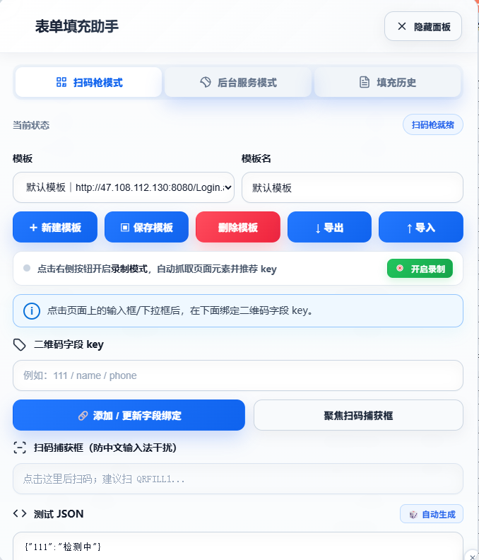

# Visual-QR 表单填充助手



一款基于浏览器的二维码表单填充工具，支持扫码枪模式和后台服务模式，帮助用户快速填充表单数据。

## 功能特性

- **扫码枪模式**: 直接捕获扫码枪输入的二维码数据，自动填充到网页表单
- **后台服务模式**: 通过 API 轮询获取数据，自动填充表单
- **模板管理**: 支持创建、编辑、删除表单绑定模板
- **字段绑定**: 可视化绑定页面字段与二维码数据 key
- **模板导出/导入**: 支持将模板导出为 JSON 文件，便于备份和迁移
- **悬浮球入口**: 提供可拖动的悬浮球，快速展开/收起面板
- **本地存储**: 所有数据保存在浏览器本地，无需服务器

## 使用方法

### 安装方式

#### 方法一：Chrome 扩展安装（推荐）

1. 打开 Chrome 浏览器，进入扩展管理页面（`chrome://extensions/`）
2. 开启右上角的"开发者模式"
3. 点击"加载已解压的扩展程序"
4. 选择项目所在的 `visual-qr` 文件夹
5. 扩展安装成功后，点击浏览器右上角的扩展图标即可使用

### 基本操作流程

```
1. 打开目标表单页面
2. 点击悬浮球展开面板
3. 点击页面上的输入框或下拉框
4. 在"二维码字段 key"输入框中输入字段标识
5. 点击"添加/更新字段绑定"
6. 扫描二维码或等待后台服务数据
7. 表单自动填充完成
```

### 扫码枪模式

1. 确保面板处于"扫码枪模式"（默认模式）
2. 点击"聚焦扫码捕获框"按钮或直接在页面输入
3. 使用扫码枪扫描包含 QRFILL1 格式的二维码
4. 数据自动解析并填充到绑定的字段

### 后台服务模式

1. 切换到"后台服务模式"
2. 输入服务地址（如 `http://localhost:3000/data`）
3. 设置轮询间隔（默认 3 秒）
4. 点击"启动轮询"
5. 服务返回的数据会自动填充到表单

### 模板管理

#### 创建模板

1. 点击"新建模板"按钮
2. 输入模板名称（如"检测表单"）
3. 点击确定创建

#### 绑定字段

1. 选择目标模板
2. 点击页面上的表单字段
3. 输入二维码字段 key
4. 点击"添加/更新字段绑定"

#### 保存模板

1. 修改模板名称后点击"保存模板"
2. 模板自动保存到浏览器本地存储

#### 导出模板

1. 选择要导出的模板
2. 点击"导出"按钮
3. 模板将下载为 JSON 文件

#### 导入模板

1. 点击"导入"按钮
2. 选择本地的模板 JSON 文件
3. 模板自动导入并切换到该模板

### 快捷键与操作

| 操作      | 说明      |
| ------- | ------- |
| 悬浮球点击   | 展开/收起面板 |
| 悬浮球拖动   | 调整悬浮球位置 |
| 面板头部拖动  | 调整面板位置  |
| 聚焦扫码捕获框 | 准备扫码输入  |

### QRFILL1 格式说明

工具使用自定义的 QRFILL1 格式来编码二维码数据：

```
QRFILL1:<base64url-encoded-json>
```

**生成示例：**

```javascript
const data = { name: "张三", phone: "1234567890" };
const encoded = "QRFILL1:" + btoa(JSON.stringify(data)).replace(/=/g, '');
```

**解码示例：**

```javascript
const qrData = "QRFILL1:eyJuYW1lIjoi5byg5LiJIiwicGhvbmUiOiIxMjM0NTY3ODkwIn0";
const jsonStr = atob(qrData.replace("QRFILL1:", ''));
const data = JSON.parse(jsonStr);
```

### 注意事项

1. **跨域限制**: 后台服务模式需要目标服务支持 CORS
2. **HTTPS 页面**: 在 HTTPS 页面中，后台服务也必须是 HTTPS
3. **数据安全**: 所有数据仅保存在浏览器本地，不会上传到服务器
4. **页面刷新**: 刷新页面后，模板和设置会自动恢复

## 技术栈

- JavaScript (ES6+)
- CSS3 (Grid/Flexbox)
- LocalStorage 持久化
- DOM 操作与事件监听

## QRFILL1 格式

生成的二维码数据格式:

```
QRFILL1:<base64url-encoded-json>
```

示例:

```
QRFILL1:eyJ1c2VybmFtZSI6InNtaXRoIiwicGhvbmUiOiIxMjM0NTY3ODkwIn0
```

## 版本更新

### v1.0

- 新增后台服务模式，支持通过 API 获取数据自动填充
- 增加美观的模式切换界面
- 品牌升级为"表单填充助手"
- 新增模板导出/导入功能
- 新增可拖动悬浮球入口

## 安全提示

仅在本地浏览器保存模板，请勿在不可信页面使用敏感数据。

## License

MIT
